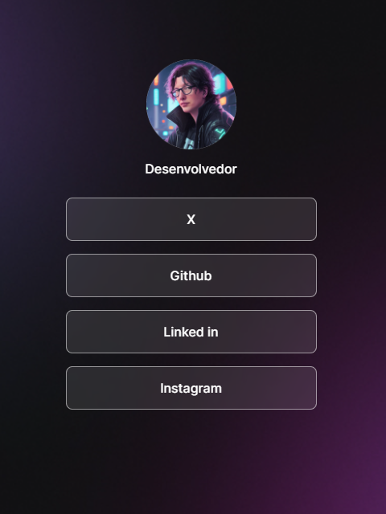

<h1 align ='center'>Links</h1>
 
<h2>Descrição do Projeto</h2>

Este projeto tem o intuito de ser um site que concentrar uma lista de links referentes a um perfil pessoal. Podendo variar entre links para páginas de redes sociais ou para sites com projetos desenvolvidos.

 
<h2>Tecnologias no projeto</h2>
Esse projeto está em desenvolvimento utilizando técnologias como:
 
<ul>
    <li> HTML
    <li> CSS
    <li> Javascript
    <li> Figma
</ul>

<h2>Prévia do projeto</h2>
<picture>
    

</picture>